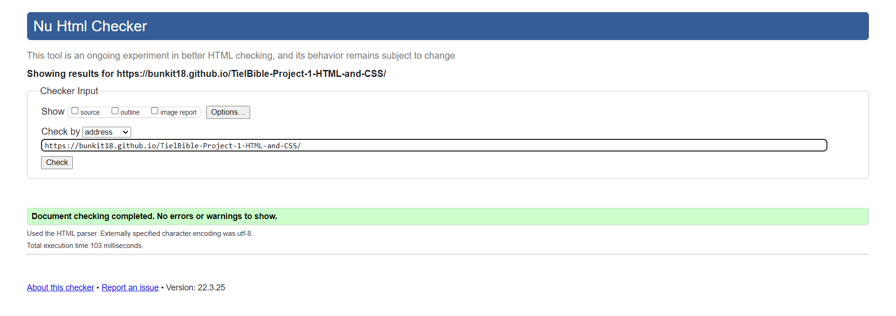

# **TielBible**

TielBible is a compact site full of specialised information that aims to provide potential, new and long-time owners of the Cockatiel parrot with as much necessary information to keep their parrot happy and healthy, as well as alleviate any stress by providing answers to common questions that may concern or confuse owners. 

TielBible will provide information on the different colour variants, gender determination, behaviour, diet and exotic / avian vet locations in the United Kingdom.

From tiel owner to tiel owner, welcome to <a href="https://bunkit18.github.io/TielBible-Project-1-HTML-and-CSS/">**TielBible**</a>.

# Table of Contents

* [**User Experience (UX)**](<#user-experience-ux>)
    * [**Design**](<#design>)
        * [**Site Structure**](<#site-structure>)
        * [**Colour Scheme**](<#colour-scheme>)
        * [**Typography**](<#typography>)
        * [**Imagery**](<#imagery>)
        * [**Wireframes**](<#wireframes>)
    * [**Features**](<#features>)
        * [**Current Features**](<#current-features>)
    * [**Technologies Used**](<#technologies-used>)
    * [**Testing**](<#testing>)
        * [**WC3 Validator**](<#validation>)
        * [**User Experience Testing**](<#user-stories>)
        * [**Past or Current existing bugs**](<#bugs>)
    * [**Deployment**](<#deployment>)
    * [**Credits**](<#credits>)
        * [**Acknowledgements**](<#acknowledgements>)

# User Experience (UX)

* ## User Stories

    * As a user I want to be able to navigate through the whole site smoothly.
    * As a user I want to understand the purpose of the site upon loading it.
    * As a user, I want to be able to learn more about cockatiels.
    * As a user, I want to be able to find relevant information on owning a cockatiel regardless of prior experience.
    * As a user, I want to be able to learn the visual differences between different genders and colour variations of cockatiels.
    * As a user, I want to be able to view examples of different defining features of a cockatiel.
    * As a user, I want to be able to understand the behaviours and emotions of a cockatiel with clear image or video examples.
    * As a user, I want to clearly understand the dietary needs of cockatiels and what food is considered toxic to them.
    * As a user, I want to be able to view a live map of the United Kindom, that advises me on veterinary services for my cockatiel.
    * As a user, I want to be able to provide feedback to TielBible based on my own experience of Cockatiels, that may be able to help others.
    * As a user, I want to be able to connect with fellow users of TielBible through social media.

[Return to top](<#table-of-contents>)

# Design

* ## Site Structure 

    TielBible is comprised of seven pages, with [Home](index.html) being the default loading page. The pages are as follows: [Variation](variation.html), [Behaviour](behaviour.html), [Diet](diet.html), [Vet Locations](vet.html) and [Contact](contact.html).

    There is a pop-up form in the footer of every page which, alongside the form in the contact page, will lead to the [Thank You](thankyou.html) page. Longer pages have a fixed 'return-to-the-top' button on the right-handside for ease of access to the header and navigation bar. 

    [Return to top](<#table-of-contents>)

* ## Colour Scheme

    The colour scheme was initially determined through two cockatiel colour palettes found on [Google](https://www.google.com): 

    Palette #1 :

    

    Palette #2 :
    
    

    After deciding to take on board palette #2, I trialed various colour compositions on the site, before deciding to use only 3 of the colours in the palette, with 3 differing hues of two of the colours, which I found with [colour-hex.com](<https://www.color-hex.com/>). 

    My final colour scheme was therefore:

    

    This palette was chosen to be personal to the common cockatiel colouration while also adding in saturated hues to stand out be more visually striking.

    [Return to top](<#table-of-contents>)

* ## Typography

    Using [Google Fonts](https://fonts.google.com/), I matched up my preferred font style for TielBible and decided on Roboto Condensed n regular 400 as a header font, and Nunito for lesser headers and paragraphs in Extra Light 200. This had a clean and condensed look, with the Roboto font being a popular choice for fonts in website design. 
    
    Both used sans serif as a fallback font in the event that either chosen font doesn't load.  

    [Return to top](<#table-of-contents>)

* ## Imagery

    My hero image is an image of a standard grey cockatiel, the most common colour variation as detailed in my site. The image was sourced from [pixabay](https://pixabay.com/), where a lot of TielBible images were sourced from. It was the ideal image for my hero image to present the site topic most clearly and in the most emotionally impacting and stiking way.

    Other images in TielBible have been influenced or sourced by the following websites:

    *[Corbyn the Cockatiel Page](https://www.facebook.com/CorbynTheCockatiel)

    *[Google.com](https://www.google.com)

    *[Pexels.com](https://www.pexels.com/)

    *[unsplash.com](https://unsplash.com/)

    *[freeimages.com](https://www.freeimages.com/)

    *[rawpixel.com](https://www.rawpixel.com/)

    [Return to top](<#table-of-contents>)

* ## Wireframes

    Initial Wireframes were produced in [Balsamiq](https://balsamiq.com/)

    Home page wireframe:

    

    Home page with modal box:

    

    Page Contents Structure wireframe:

    

    Vets Locations embedded map page:

    

    Contact page and form wireframe:

    

    There may be differentation in the final site due to responsiveness.

    [Return to top](<#table-of-contents>)

# Features

TielBible was created with ease of navigation in mind. A navigation bar is included in the header for all pages, with clear titles of the context of the information provided in each page. Each page, if required, has clearly defined links to each sub-section. Pages are designed to be simple and have an overarching structure through pages to ensure the site is easy to use and navigate.
    
All pages are responsive for other viewports, such as tablets and mobiles. The structure of the page doesn't differ in different viewports.

* ## 

# Technologies Used 

Languages used in this project:

* HTML5
* CSS3

Frameworks, Libraries and Programs used:

* [Bootstrap](https://getbootstrap.com/docs/4.4/getting-started/introduction/) - responsive media queries.
* [Hover.css](https://ianlunn.github.io/Hover/) - for :hover instances for links.
* [Balsamiq](https://balsamiq.com/) - wireframes.
* [Google Fonts](https://fonts.google.com/) - Fonts.
* [Font Awesome](https://fontawesome.com/) - Icons.
* [Github](https://github.com/) - repository storage.
* [Gitpod](https://gitpod.io/) - compiler and Git code storage.

# Testing 

Testing was involved in every stage of the creation of TielBible's creation, in an ongoing process with Google's Developer Tools, as well as WC3's validation services for HTML markup and CSS. 

All pages of TielBible have been validated by these services, which ensure that the syntax for the site is clear and error-free.

* ## User Experience Testing

* As a user I want to be able to navigate through the whole site smoothly.

    1. All pages have the same header and footer links, including the navigation bar that is a part of the header, which allows the user to navigate through the site at any time, leaving no potential for the user to be trapped.

    2. On longer pages of large content, a 'return to top' button is fixed on the right-hand-side, allowing the user to quickly and painlessly return to the navigation pane and redirect themselves elsewhere through the site.

    3. When submitting information through a form via the mailing list popup or contact page, the user is taken to a page thanking them for their contact and a link that allows them to return to the home page.

    4. Each page has a flowing method behind its structure, with each sub-header having the posibility to be jumped to via a link at the top of the page. Headers are semantically created, with the h1 element leading to one or multiple h2 elements, which may progress to further h3 elements. 

* As a user I want to understand the purpose of the site upon loading it.
    
    1. Upon entering the site, users are automatically greeted with a clean and easily readable title bar and a navigation bar, to go to the page of their choice. Underneath the navigation bar is the Cockatiel Hero Image, with a short summaried text that alerts the user as to the main content that can be found on the site.

    2. The Hero Image is of a cockatiel, which, combined with the feather icon in the h1 header, clearly delineates the main points of the page.

    3. From the home (index) page, the user has two choices, click on a navigation pane for information on one of TielBible's pages or click on the links provided in the footer, to either visit a social media page or to join the mailing list for more personalised information to be sent to the users inbox.

* As a user, I want to be able to learn more about cockatiels.

    1. The pages in the navigation bar provides the user with all basic, necessary information about cockatiels and what an owner needs to know. Each page can be navigated in order if preferred, but can also be easily understood if navigated randomly.

    2. Each page clearly outlines necessary details about cockatiels, alongside pictures, videos and video controls. All pictures include an alt attribute for accessiblity for users who require screens readers, and are usually nested in a figure element alongside a caption outlining basic details of the image or video.

    3. The user can easily initiate contact via a contact form and enquire about aspects of a cockatiel that they may not understand or require further advice on. There is also the option for users to provide and share information to TielBible, which can be added to the page and provided freely to other users which may have encountered the same circumstances. 

* As a user, I want to be able to find relevant information on owning a cockatiel regardless of prior experience.

    1. All information on the TielBible site is provided in a flowing manner, starting from basic to advanced knowledge, which makes it suitable for all users of all experience and knowledge levels. Visuals and audio are also provided to further supplement knowledge, ensuring clarity of the topic at hand.

* As a user, I want to be able to learn the visual differences between different genders and colour variations of cockatiels.

    1. There is a full page on TielBible that clearly details the visual differences between cockatiels, from colour mutation to gender determination, which are usually the most asked questions in the cockatiel community. This is the first page the user can navvigate to through the navigation bar, detailed 'Variation'.

* As a user, I want to be able to view examples of different defining features of a cockatiel.

    1. Images and videos with video controls are provided in the relevant pages to assist the user in their comprehension and to ensure lack of confusion about a topic.

* As a user, I want to be able to understand the behaviours and emotions of a cockatiel with clear image or video examples.

    1. Detail provided to the user on the behaviour page goes in depth using common english, the factors involved in understanding the behaviour of a cockatiel as much as possible, which were provided from experience of other cockatiel owners or veterinarians with studious knowledge of the topic. This is further supplemented with photographic or video based evidence of what had been discussed.

* As a user, I want to clearly understand the dietary needs of cockatiels and what food is considered toxic to them.

    1. The 'diet' page goes into above and beyond detail on the diet of a cockatiel in heirarchical format for all users to understand. Images are provided to usrs throughout the page, with multiple external navigation options for further information or purchase of the item in question.

    2. Toxic foods that a cockatiel cannot have in their diet is clearly stated to the used in an easy to comprehend table

    3. An image provided to the user has further image area navigation links for a product that has similar forms 'pellets', which changes the layout slightly and keeps the user more interested and engaged. 
    
    4. The user can navigate to the contact page when unsure, for further personalised information and assistance.

* As a user, I want to be able to view a live map of the United Kindom, that advises me on veterinary services for my cockatiel.

    1. The 'vet locations' page includes a self created google map that the user and members of the public can access and review or add to. All veterinary practices included on the map have been reviewed and deemed appropriate for user needs, in providing locations of vets in the United Kingdom that examine and treat avians/birds. 

* As a user, I want to be able to provide feedback to TielBible based on my own experience of Cockatiels, that may be able to help others.

    1. Users can volunteer up their own experiences for collaborative use on TielBible for the benefit of other users after them. They can do this by filling out the contact page form and ticking 'add to page' checkbox, alongside adding the details of their addition to the text area provided. 

    2. Users can access social media links to access platforms in which they can talk to and discuss with other users, which may build upon the information provided on the TielBible site.

* As a user, I want to be able to connect with fellow users of TielBible through social media.

    1. Links for Facebook, Twitter, Instagram and Reddit are included in the footer of every page on the TielBible site, which immediately redirects them to their link of choice. They can then interact with other users or interested parties regarding cockatiels as required.

    
    

