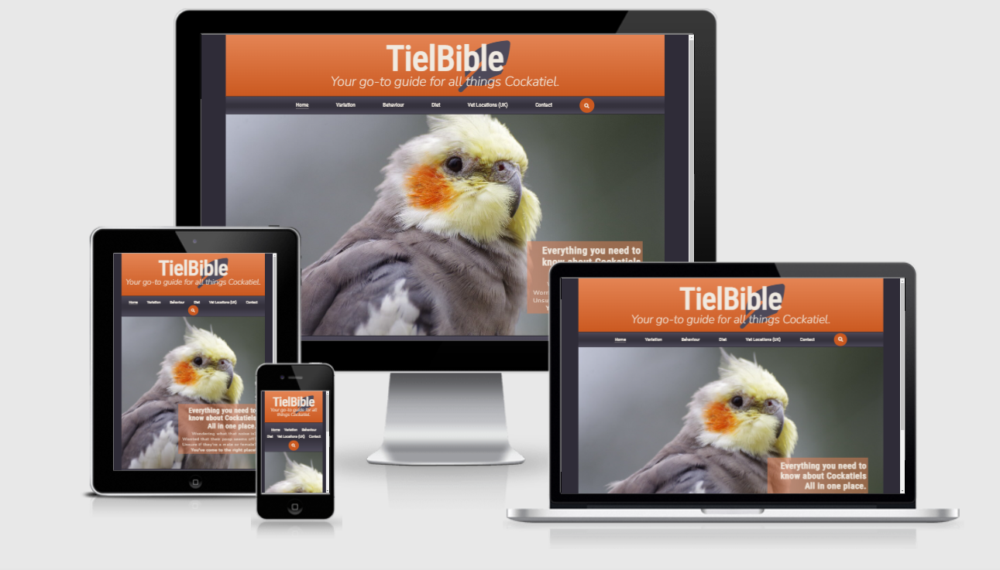
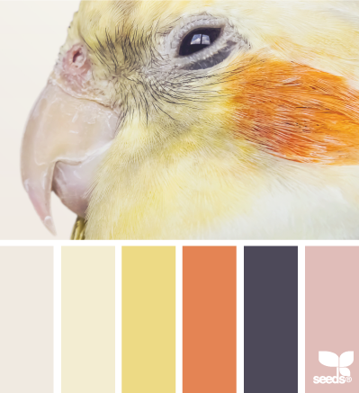
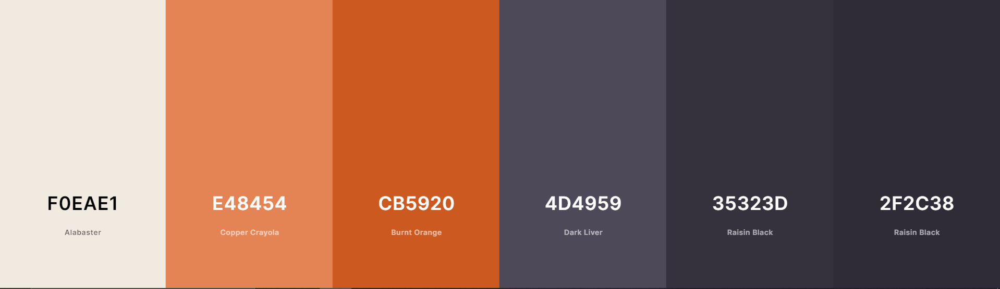

# **TielBible**

TielBible is a compact site full of specialised information that aims to provide potential, new and long-time owners of the Cockatiel parrot with as much necessary information to keep their parrot happy and healthy, as well as alleviate any stress by providing answers to common questions that may concern or confuse owners. 

TielBible will provide information on the different colour variants, gender determination, behaviour, diet and exotic / avian vet locations in the United Kingdom.

From tiel owner to tiel owner, welcome to <a href="https://bunkit18.github.io/TielBible-Project-1-HTML-and-CSS/">**TielBible**</a>.

# Table of Contents

* [**User Experience (UX)**](<#user-experience-ux>)
    * [**Design**](<#design>)
        * [**Site Structure**](<#site-structure>)
        * [**Colour Scheme**](<#colour-scheme>)
        * [**Typography**](<#typography>)
        * [**Imagery**](<#imagery>)
        * [**Wireframes**](<#wireframes>)
    * [**Features**](<#features>)
    * [**Technologies Used**](<#technologies-used>)

# User Experience (UX)

* ## User Stories

    * As a user I want to be able to navigate through the whole site smoothly.
    * As a user I want to understand the purpose of the site upon loading it.
    * As a user, I want to be able to learn more about cockatiels.
    * As a user, I want to be able to find relevant information on owning a cockatiel regardless of prior experience.
    * As a user, I want to be able to learn the visual differences between different genders and colour variations of cockatiels.
    * As a user, I want to be able to view examples of different defining features of a cockatiel.
    * As a user, I want to be able to understand the behaviours and emotions of a cockatiel with clear image or video examples.
    * As a user, I want to clearly understand the dietary needs of cockatiels and what food is considered toxic to them.
    * As a user, I want to be able to view a live map of the United Kindom, that advises me on veterinary services for my cockatiel.
    * As a user, I want to be able to provide feedback to TielBible based on my own experience of Cockatiels, that may be able to help others.
    * As a user, I want to be able to connect with fellow users of TielBible through social media.

[Return to top](<#table-of-contents>)

# Design

* ## Site Structure 

    TielBible is comprised of seven pages, with [Home](index.html) being the default loading page. The pages are as follows: [Variation](variation.html), [Behaviour](behaviour.html), [Diet](diet.html), [Vet Locations](vet.html) and [Contact](contact.html).

    There is a pop-up form in the footer of every page which, alongside the form in the contact page, will lead to the [Thank You](thankyou.html) page. Longer pages have a fixed 'return-to-the-top' button on the right-handside for ease of access to the header and navigation bar. 

    [Return to top](<#table-of-contents>)

* ## Colour Scheme

    The colour scheme was initially determined through two cockatiel colour palettes found on [Google](https://www.google.com): 

    Palette #1 :

    

    Palette #2 :
    
    

    After deciding to take on board palette #2, I trialed various colour compositions on the site, before deciding to use only 3 of the colours in the palette, with 3 differing hues of two of the colours, which I found with [colour-hex.com](<https://www.color-hex.com/>). 

    My final colour scheme was therefore:

    

    This palette was chosen to be personal to the common cockatiel colouration while also adding in saturated hues to stand out be more visually striking.

    [Return to top](<#table-of-contents>)

* ## Typography

    Using [Google Fonts](https://fonts.google.com/), I matched up my preferred font style for TielBible and decided on Roboto Condensed n regular 400 as a header font, and Nunito for lesser headers and paragraphs in Extra Light 200. This had a clean and condensed look, with the Roboto font being a popular choice for fonts in website design. 
    
    Both used sans serif as a fallback font in the event that either chosen font doesn't load.  

    [Return to top](<#table-of-contents>)

* ## Imagery

    My hero image is an image of a standard grey cockatiel, the most common colour variation as detailed in my site. The image was sourced from [pixabay](https://pixabay.com/), where a lot of TielBible images were sourced from. It was the ideal image for my hero image to present the site topic most clearly and in the most emotionally impacting and stiking way.

    Other images in TielBible have been influenced or sourced by the following websites:

    *[Corbyn the Cockatiel Page](https://www.facebook.com/CorbynTheCockatiel)

    *[Google.com](https://www.google.com)

    *[Pexels.com](https://www.pexels.com/)

    *[unsplash.com](https://unsplash.com/)

    *[freeimages.com](https://www.freeimages.com/)

    *[rawpixel.com](https://www.rawpixel.com/)

    [Return to top](<#table-of-contents>)

* ## Wireframes

    Initial Wireframes were produced in [Balsamiq](https://balsamiq.com/)

    Home page wireframe:

    

    Home page with modal box:

    

    Page Contents Structure wireframe:

    

    Vets Locations embedded map page:

    

    Contact page and form wireframe:

    

    There may be differentation in the final site due to responsiveness.

    [Return to top](<#table-of-contents>)

# Features

TielBible was created with ease of navigation in mind. A navigation bar is included in the header for all pages, with clear titles of the context of the information provided in each page. Each page, if required, has clearly defined links to each sub-section. Pages are designed to be simple and have an overarching structure through pages to ensure the site is easy to use and navigate.
    
All pages are responsive for other viewports, such as tablets and mobiles. The structure of the page doesn't differ in different viewports.

* ## 

# Technologies Used 

Languages used in this project:

* HTML5
* CSS3

Frameworks, Libraries and Programs used:

* [Bootstrap](https://getbootstrap.com/docs/4.4/getting-started/introduction/) - responsive media queries.
* [Hover.css](https://ianlunn.github.io/Hover/) - for :hover instances for links.
* [Balsamiq](https://balsamiq.com/) - wireframes.
* [Google Fonts](https://fonts.google.com/) - Fonts.
* [Font Awesome](https://fontawesome.com/) - Icons.
* [Github](https://github.com/) - repository storage.
* [Gitpod](https://gitpod.io/) - compiler and Git code storage.

    
    

